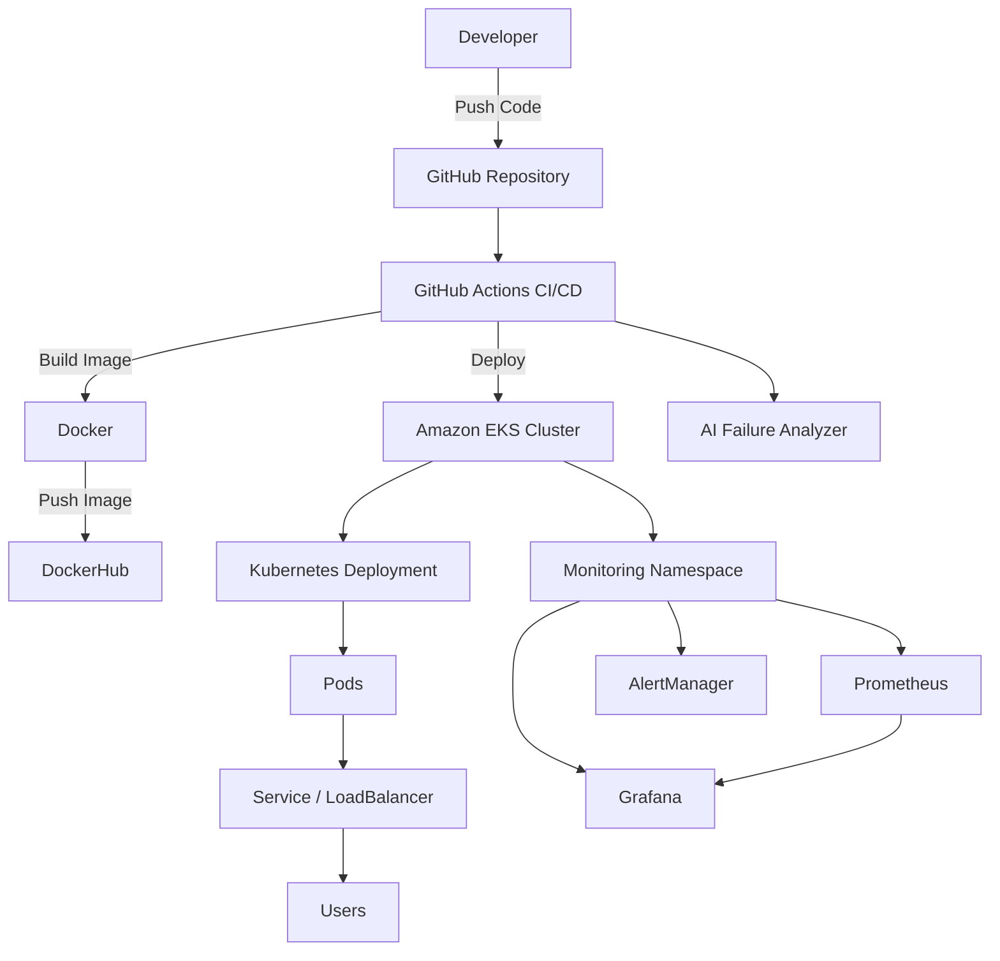

# 🚀 AI-Powered DevOps CI/CD Pipeline with Kubernetes (EKS), Observability & Failure Analysis

## 📌 Project Overview

This project demonstrates a **production-style DevOps platform** that automates application delivery, deployment, monitoring, and failure analysis.

It includes:

- Automated **CI/CD pipeline**
- **Dockerized microservice**
- Deployment to **Amazon EKS (Kubernetes)**
- Observability using **Prometheus & Grafana**
- **AI-powered CI/CD failure analysis**
- Kubernetes **health checks, rollouts, and rollback support**

The goal of this project is to simulate how modern DevOps teams build **reliable cloud-native delivery pipelines**.

---

# 🏗️ Architecture



## ⚙️ Technology Stack
### Cloud

- AWS EKS

- AWS EC2

- AWS Load Balancer

### Containerization

- Docker

- DockerHub

### CI/CD

- GitHub Actions

### Orchestration

- Kubernetes

### Observability

- Prometheus

- Grafana

- Alertmanager

### DevOps Tools

- Helm

- kubectl

- eksctl

### AI Integration

- OpenAI API (for pipeline failure analysis)

---
## Project Stucture
```
ai-devops-pipeline
│
├── app/
│   └── app.py
│
├── k8s/
│   ├── deployment.yaml
│   └── service.yaml
│
├── monitoring/
│   └── prometheus-alerts.yaml
│
├── ai-analyzer/
│   └── analyze_logs.py
│
├── .github/workflows/
│   └── pipeline.yml
│
├── Dockerfile
├── requirements.txt
└── README.md
```
---
## 🚀 Application

A simple Python Flask application used to demonstrate CI/CD and deployment.

Example response:
```
AI DevOps Pipeline Running and Updated
```
---
## 🐳 Dockerization
### Dockerfile
```
FROM python:3.10-slim

WORKDIR /app

COPY requirements.txt .

RUN pip install --no-cache-dir -r requirements.txt

COPY app/ .

EXPOSE 5000

CMD ["python", "app.py"]
```
### Build Docker Image
```
docker build -t lucky352/ai-devops-app:v1 .
```
### Push Docker Image
```
docker push lucky352/ai-devops-app:v1
```
---
## ☸️ Kubernetes Deployment

### Key Kubernetes features implemented:

- Deployment

- Service

- LoadBalancer

- Rolling updates

- Health probes

---
## 🔄 CI/CD Pipeline

CI/CD is implemented using GitHub Actions.
Pipeline Workflow :
```
Code Push
   ↓
GitHub Actions
   ↓
Build Docker Image
   ↓
Push to DockerHub
   ↓
Update Kubernetes Deployment
   ↓
Rolling Update
```
Pipeline Responsibilities:
- Build container images

- Push images to registry

- Authenticate with AWS

- Deploy to EKS cluster

- Track deployment history

---
## 🔁 Kubernetes Deployment Management
Check Deployment Rollout
```
kubectl rollout status deployment ai-devops-app
```
Deployment History
```
kubectl rollout status deployment ai-devops-app
```
Rollback
```
kubectl rollout undo deployment ai-devops-app
```
---
## 🤖 AI-Powered CI/CD Failure Analyzer
The pipeline include a Custom AI Analyzer that evaluates CI/CD failure.
Workflow:
```
Pipeline Failure
      ↓
Collect Logs
      ↓
Send Logs to LLM
      ↓
AI explains root cause
      ↓
Suggested fix
```
This simulates how AI can assist DevOps teams in automated troubleshooting.

---
## 📊 Observability Stack

Monitoring tools installed using Helm.

Components deployed:

- Prometheus

- Grafana
 
- Alertmanager

- Node Exporter

- kube-state-metrics

Namespace used:
monitoring

---
## 📈 Grafana Dashboards

Grafana provides dashboards for:

- Kubernetes Nodes

- Pod CPU usage

- Memory utilization

- Network traffic

- Container restarts

Example dashboards:
```
Kubernetes / Compute Resources / Node
Kubernetes / Compute Resources / Pod
Kubernetes / Networking
Kubernetes / API Server
```

---
## 🚨 Alerting with Prometheus

Example alert rule:
```
PodCrashLooping
```
Alert triggers when container restarts repeatedly.

Example rule:
```
increase(kube_pod_container_status_restarts_total[5m]) > 3
```
Alert stats:
```
| State    | Meaning           |
| -------- | ----------------- |
| Inactive | Condition not met |
| Firing   | Alert triggered   |
```
---
## Monitoring Architecture
```
EKS Cluster
│
├── production namespace
│   └── ai-devops-app
│
└── monitoring namespace
    ├── Prometheus
    ├── Grafana
    ├── Alertmanager
    └── Node Exporter
```
## 🔐 Best Practices Implemented

- Immutable container images

- Infrastructure isolation using namespaces

- Automated deployments

- Health probes

- Observability

- Alerting

- Deployment rollback

- CI/CD automation
---
## 📌 Key Learnings

- End-to-end DevOps automation

- Containerized application delivery

- Kubernetes orchestration

- Cloud infrastructure management

- Monitoring and observability

- AI-assisted troubleshooting

---
## 💼 Resume Description

### DevOps Engineer Project

- Designed and implemented an end-to-end CI/CD pipeline using GitHub Actions, Docker, and AWS EKS.

- Automated container builds and deployments with rolling updates and rollback support.

- Implemented Kubernetes health checks (liveness & readiness probes) to improve application reliability.

- Deployed a monitoring stack using Prometheus and Grafana for real-time cluster observability.

- Implemented Prometheus alerting rules to detect pod crashes and system anomalies.

- Built an AI-powered CI/CD failure analyzer that processes pipeline logs and suggests root causes using LLM APIs.

- Managed infrastructure using Helm, kubectl, and eksctl in a cloud-native environment.
---
## 🚀 Future Improvements

Potential enhancements:

- Horizontal Pod Autoscaler (HPA)

- Slack alert integration

- GitOps deployment using ArgoCD

- ServiceMonitor for application metrics

- Distributed tracing with Jaeger
---
## 📚 References

- Kubernetes Documentation

- AWS EKS Documentation

- Prometheus Documentation

- Grafana Documentation

- Helm Charts Repository
---
## ⭐ Conclusion

This project demonstrates a production-style DevOps platform integrating:

- CI/CD automation

- Kubernetes orchestration

- Monitoring and observability

- Intelligent failure analysis
