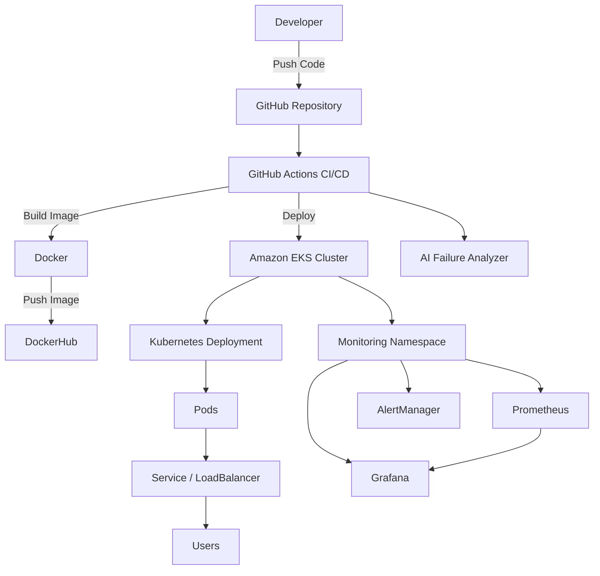

# 🚀 AI-Powered DevOps CI/CD Pipeline with Kubernetes (EKS), Observability & Failure Analysis

## 📌 Project Overview

This project demonstrates a **production-style DevOps platform** that automates application delivery, deployment, monitoring, and failure analysis.

It includes:

- Automated **CI/CD pipeline**
- **Dockerized microservice**
- Deployment to **Amazon EKS (Kubernetes)**
- Observability using **Prometheus & Grafana**
- **AI-powered CI/CD failure analysis**
- Kubernetes **health checks, rollouts, and rollback support**

The goal of this project is to simulate how modern DevOps teams build **reliable cloud-native delivery pipelines**.

---

# 🏗️ Architecture

##⚙️ Technology Stack
###Cloud

- AWS EKS

- AWS EC2

- AWS Load Balancer

###Containerization

- Docker

- DockerHub

###CI/CD

- GitHub Actions

###Orchestration

- Kubernetes

###Observability

- Prometheus

- Grafana

- Alertmanager

###DevOps Tools

- Helm

- kubectl

- eksctl

###AI Integration

- OpenAI API (for pipeline failure analysis)
